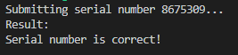

# Project 4

## Problem 1
Obtain the file overflow.zip from the textbook website and extract the Windows executable.

1. Exploit the buffer overflow so that you bypass its serial number check. Submit a screen capture to verify your success.

2. Determine and submit the correct serial number.

For solution see [bo-excercise](bo-excercise).

## Problem 2
Obtain the Windows executable contained in securityclass.zip. The file securityclass.exe is a Windows executable. Run it from a command prompt. Write a program which will repeatedly call securityclass.exe using the linearization attack to determine the correct seven-digit serial number. 

Submit the source code of your program and the correct serial number.

**Note:** securityclass.exe takes a serial number as a command line argument. So if you guess that the serial number may be 0000000, run it as follows: 

    securityclass.exe 0000000

For solution see [src/main.py](src/main.py)