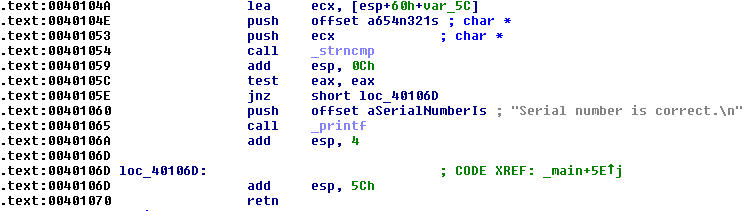
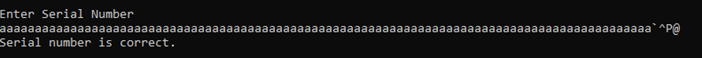
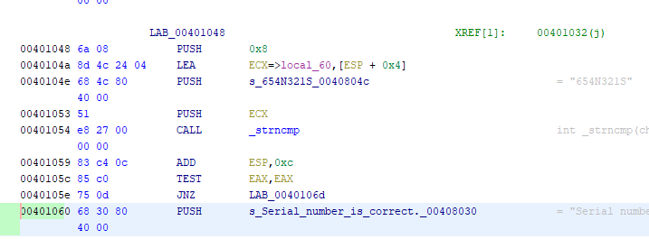
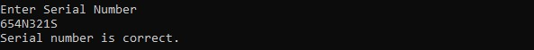

# Buffer Overflow Exploit
### Steps Taken to Exploit Buffer Overflow Vulnerability in bo2.exe

1. Enter some unusual inputs in an attempt to discover more about the application.

    I tried entering several invalid values including long strings of A's, Z's, 0's, etc. The program gave no warnings, so not much to go on here. The only clue is a message stating "Error! Input must be < 100 characters."

2. Observe the assembly code. This image was provided by the textbook author. This is just a disassembled application.

    

    We can see that the string "Serial number is correct." exists at address 0x401060. Converting this to ASCII representation, we get "@^P\`" where ^P is control-p. The machine that I am testing on is using little endian convention, so I will need to append "\`^P@" at the overflow point. Doing so produces the following result.

    

3. To find the actual serial number, the application just needs to be disassembled. After disassembly, the serial number is given in plaintext. I used Ghidra for disassembly.

    

    We see that the serial number is 654N321S. We can confirm by entering it into the application interface.

    

This excercise shows how buffer overflow can be exploited. For malicious attacks, the return address of executable code could be passed into the buffer.
